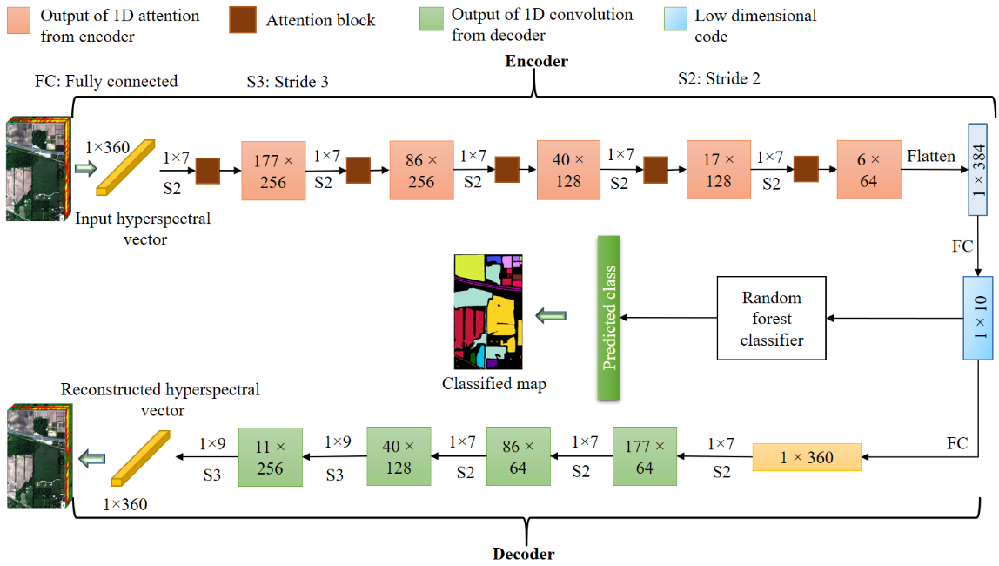
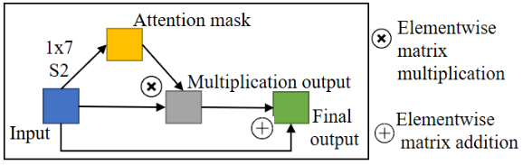

# Attentional Autoencoders for Hyperspectral Dimensionality Reduction

Hyperspectral images (HSIs) are being actively used for landuse/land cover classification owing to their high spectral resolution. However, this leads to the problem of high dimensionality, making the algorithms data hungry. To resolve these issues, deep learning techniques, such as convolution neural networks (CNNs) based autoencoders, are used. However, traditional CNNs tend to focus on all the features irrespective of their importance, leading to weaker representations. To overcome this, we incorporate attention modules in our autoencoder architecture. These attention modules explicitly focus on more important wavelengths, leading to better transformation of the features in the low dimension. In the proposed method, the attention driven encoder transforms high dimension features to low dimensions, considering their relative importance, while the CNN based decoder reconstructs the original features. We evaluate our method on Indian pines 2010 and Indian pines 1992 hyperspectral datasets, where it surpasses the previous approaches.





>URL to the paper: https://ieeexplore.ieee.org/stamp/stamp.jsp?arnumber=9553019

Requirement:

```
Tensorflow 2
```
Steps:

```
1. Download the dataset from the provided URL in data folder
```
```
2. Run data_prepare.py
```
```
3. Run model_attae.py
```

If using the concept or code, kindly cite the paper as: 
>S. Pande, B. Banerjee. Attention based convolution autoencoder for dimensionality reduction in hyperspectral images. IEEE International Geoscience and Remote Sensing Symposium (IGARSS), July, 2021.

You can also use the bibtex as:
```
@inproceedings{pande2021attention,
  title={Attention Based Convolution Autoencoder for Dimensionality Reduction in Hyperspectral Images},
  author={Pande, Shivam and Banerjee, Biplab},
  booktitle={2021 IEEE International Geoscience and Remote Sensing Symposium IGARSS},
  pages={2727--2730},
  year={2021},
  organization={IEEE}
}
```
